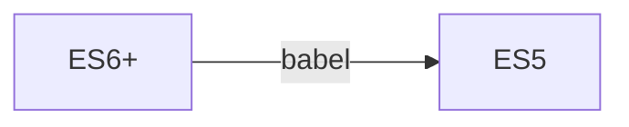
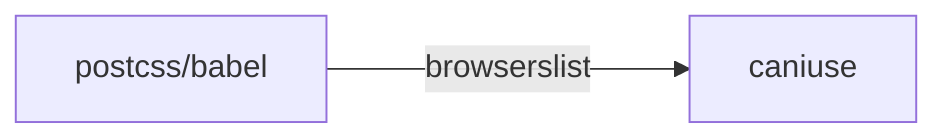

# 背景

> `webpack`静态模块化打包工具。无论是前端工程化，还是高级前端岗位都是绕不开的话题之一，面试经常问到构建优化的的方案，自定义`loader`，自定义`plugin`等。无论是进阶，还是面试高级岗位，在这里你都可以找到答案。`webpack`简单来说就是各种令人眼花缭乱的配置，笔者也是感同身受，学了很快就会忘记，所以才有了这篇文章。采用`费曼学习法`，用简洁的思想和简单的语言向大家表达出来，帮助大家也是帮助自己，本文的学习资料大部分来自于官方文档。本文将持续迭代，收藏`===`学会～


## 安装
```shell
# 创建文件夹
mkdir learn-webpack 
# 进入文件夹
cd learn-webpack
# 初始化
pnpm init
# 安装依赖
pnpm i webpack webpack-cli -D
```
## 结构划分
代码仓库：https://github.com/GetWebHB/webpack-advanced
- 每一个小的章节，都会存放在对应的文件夹中（例：`0.start`），文件夹会存放对应的**配置文件**,**源代码**，**产物**。打包命令如下所示，`b-0`为`build-step0`的简写，方便大家理解
```js
// package.json
  "scripts": {
    "b-0": "webpack --config ./packages/0.start/webpack.config.js"
  },
```
`scripts`脚本，本质上就只在`.bin`文件夹下寻找webpack, 即`npm run b-0`等同于`npx webpack`，`--config`代表配置文件存在的目录。  
因为每个章节都会有不一样的配置，给它们拆分开这样会更加清晰。如果是公司项目中不需要这样，一般只会有一个配置文件`webpack.config.js`,存放在同`package.json`目录，就不需要指定配置文件路径，执行`npm run build`会自动去根目录查找`webpack.config.js`配置文件


**目录结构**
```
├── README.MD
├── package.json
├── packages
│   └── 0.start
│       ├── build
│       │   └── bundle.js
│       ├── src
│       │   └── main.js
│       └── webpack.config.js
└── pnpm-lock.yaml
```
类似于`monorepo`的组织方式，但是`package.json`只存在一个,不需要`cd`到对应的目录下

## 起手式
本节代码见：`0.start`

```js
// main.js
function sayHi() {
  console.log('hi ice 24')
}
sayHi()
export { sayHi }

// webpack.config.js
const { resolve } = require('path')

module.exports = {
  entry: resolve(__dirname, './src/main.js'),
  output: {
    path: resolve(__dirname, 'build'),
    filename: 'bundle.js',
  },
}

```
- 简单走读一下，`cjs`的方式导出了一个对象
1. `entry`代表入口，发现我们使用的是绝对路径，因为默认情况下相对路径为`package.json`存在的目录
2. `output`代表出口，即产物打包后的位置，同样是绝对路径，打包到`build`的文件夹下，文件名为`bundle.js`
3. `npm run b-0`, 即打包产物，就会发现该目录下出现了产物
## mode&devtool
本节代码见：`1.mode_devtool`  
上一小节中，我们学习到了`entry`,`output`这两项配置，这一章节中，我们学习`mode`和`devtool`  
### mode
概述：告诉webpack使用相应模式的内置优化  
当我们执行`npm run b-0`的时候，`webpack`会有这一串警告，说我们没有设置`mode`

那什么是模式（即`mode`）,从提示看说我们可以设置为`development`or`production`   
**传送门**：https://webpack.js.org/configuration/mode/


mode也是最重要的优化，`webpack`都会帮我们做好。接下来我们来一一了解对应模式展示的不同行为
- `mode` = `'none' | 'development' | 'production'(default)`
```js
// main.js
const mes = 'hi ice 24'
function sayHi() {
  console.log(mes)
}
sayHi()

export { sayHi }
```
#### none 
**产物分析**


- 我们大致扫一眼即可

#### development
我们平常使用的`cli`, `vue/cli`(维护阶段)，`create-react-app`等，反正所有底层使用`webpack`的，`npm run serve / npm run start`这种在本地开启服务的，采用的策略都是使用`development`，主打的就是一个快，不需要通过一些`plugin`，例如`terser`（后面会讲）丑化压缩代码  
**产物分析**

从注释中我们可以得知，它使用`eval`函数可以在浏览器的开发工具中创建一个单独的源文件，在或者说`devtool`:`false`的时候就会移除（`source map`），那么创建一个单独的文件可以干嘛呢？可以映射到代码报错的位置，这也是`devtool`配置项的作用，我们后面会详细探讨。
#### production

就是那么朴实无华，甚至连`函数`都帮你执行了，直接打印出结果
### devtool
概述：是否生成，控制如何生成source map(源码映射)，不同的值会明显影响到构建(build)和重新构建(rebuild)的速度。  
**默认值**
- `dev: eval`  
- `prod: none`  
**传送门**：https://webpack.docschina.org/configuration/devtool/


这幅图比较重要，介绍了该配置项的性能怎样，是否使用于`production`中，以及构建的速度如何
- 在`mode`模式为`development`中，我们看见了`eval`函数，可以映射出代码的错误位置信息，即配置为`mode: "eval"`，现在让我们来深入探讨一下`devtool`  

就拿`mode:prod`来说，我们发现代码是已经被丑化过，编译后的产物，如果在测试阶段，代码发生了错误压根不知道代码出错在哪里，那我们如何`debug`呢？这正是`source map`的作用，编译后的产物 ->（映射）源代码的位置   
#### false
```js
// main.js
const mes = 'hi ice 24'
function sayHi() {
  console.log(mes)
}
console.log(age) // age is not defined
sayHi()

export { sayHi }

// bundle.js
(()=>{"use strict";console.log(age),console.log("hi ice 24")})();
```
跑到浏览器上（测试阶段），我们可以看到错误信息，但是却看不到代码详细出错在第几行，这在一个庞大的项目中，是非常致命的（即`devtool: false`）,不开启`source map`


#### eval
使用`eval`函数可以在浏览器的开发工具中创建一个单独的`source map`

#### source-map
当我们配置改为它，我们先看下产物


会多出来一个.map的文件，即源码映射文件，最后一行代表着引用哪个.map文件，接下来我们在到浏览器下看下行为。


竟然神奇的映射出来了源代码的位置（第几行，甚至第几个字符），非常的神奇是吧


接下来，让我们继续深入探究，简单看下`map`文件


- version：3，从之前1，2的版本构建出来的map文件有点大，随着不断的迭代构建出来的`.map`文件也越来小
- file：映射的源文件（转换后的源文件）
- mappings：记录位置信息的字符串（VLQ编码）
- sources：源的路径
- sourcesContent：源代码的内容
- names：转换前的所有变量名和属性名
- sourceRoot：映射目录的位置，为根目录

#### 最佳实践
- prod：`none(默认) | false`
- test：`source-map`
- development: `source-map`

## babel
本节代码见：`2.babel`  
babel你可能不太了解（因为`cli`全部帮我们做好了,配置`presets`），但是它现在是前端工程化必不缺少的一部分，它的本质就是一个
**编译器**，把A源代码转换为B源代码。更通俗的说：把`ES6+`的代码转换为`ES5`的代码，可以适配版本更低的浏览器




过程大致分为3个阶段
1. 解析阶段
    - 词法分析，语法分析，生成ast树（抽象语法树）
2. 转换阶段
    - 转换为新的ast树
3. 生成阶段

### 基础使用
基础使用，我们不再讲解，直接看官网即可，还是比较简单的，它可以在终端直接使用，因为提供了对应的`CLI`工具
- 传送门：https://babel.docschina.org/docs/usage
### webpack中使用
```js
// main.js ES6代码
let mes = 'hi ice'
console.log(mes.toUpperCase())
console.log(mes.slice(0, 2))

const double = [1, 2, 3].map((num) => num * 2)
console.log(double) // [2,4,6]
```
安装开发时依赖，插件作用分别是  
1. 转换箭头函数
2. 转换块级作用域
3. 以及babel-loader
4. `@babel/core`不需要安装，因为`loader`中存在关联会被下载下来
```shell
pnpm i @babel/plugin-transform-arrow-functions @babel/plugin-transform-block-scoping babel-loader -D
```
走读一下配置，`module`中`rules`，匹配`js`文件，采用`loader`进行转换,其中`configFile`代表`babel.config.js`的路径，如果不配置这个路径则默认去`root`去查找配置文件(即`package.json`的目录)  
`options`里可以写`babel`的配置，也可以单独抽成一个独立的文件（`babel.config.js`）
```js
// webpack.config.js
const { resolve } = require('path')

module.exports = {
  mode: 'production',
  entry: resolve(__dirname, './src/main.js'),
  output: {
    path: resolve(__dirname, 'build'),
    filename: 'bundle.js',
  },
  module: {
    rules: [
      {
        test: /\.js$/,
        loader: 'babel-loader',
        options: {
          configFile: resolve(__dirname, "./babel.config.js"),
        },
      },
    ],
  },
}
```
使用`plugins`进行源代码代码转换
```js
// babel.config.js
module.exports = {
  plugins: ['@babel/plugin-transform-block-scoping', '@babel/plugin-transform-arrow-functions'],
}
```
执行`npm run b-2`查看打包的产物就会发现已经转换好了  
那么当我们高级语法有很多很多，比如`promise async await`等，我们难道一个一个去安装插件吗，这样显得太繁琐了，所以这个时候`preset`（预设）就登场了，提前把那些高级特性全部帮我们设置好
```shell
pnpm i @babel/preset-env -D
```
```js
// babel.config.js
module.exports = {
  presets: ['@babel/preset-env'],
}
```
接下来，在执行`npm run b-2`,效果一样，但是已经帮我们设置好了预设，高级语法都会被打包成低版本的代码，那提前帮我们安装了哪些插件呢？
详见：https://babel.docschina.org/docs/babel-preset-env  
`@babel/preset-env` 其中的`env`即是根据环境查询兼容性（`browserslist`）后面我们会讲解到
### polyfill
polyfill(补丁)，前面我们说到`preset-env`，可以把我们使用的高级语法，打包成更多浏览器适配的语法，但是对于某种`API`，不存在的情况它是无能为力的。比如`replaceAll` **ES2021**提出的，而`polyfill`就会帮我注入对应的`API`

**未使用polyfill**


我们能非常直观的观察到，该`replaceAll`,直接被构建出来了，但是在低版本的浏览器上肯定是没有这个`API`的，就会出现类似的错误`Uncaught TypeError: mes.replaceAll is not a function`,笔者在实际生产中(微信浏览器上)，遇到了类似的`bug`，我们应该如何解决呢？    
**前置知识**  
```shell
pnpm i core-js regenerator-runtime
```
注意不是开发时依赖，因为它实际要被我们注入到代码当中，其中这两个包代表用于模拟完整的 `ES2015+` 环境  
#### 1. 直接引入API
我们可以根据实际需要直接引入对应的`API`即可，好比上方的`replaceAll`,我们知道它是较新的语法，直接从`core-js`引入即可
```js
// main.js
import 'core-js/es/string/replace-all'
```
进行打包，然后我们再次在分析下产物,对应的`API`就被注入到我们的产物当中，就实现了`polyfill`


#### 2.useBuiltIns

```js
// babel.config.js
const path = require('path')
module.exports = {
  presets: [
    [
      '@babel/preset-env',
      {
        corejs: 3,
        useBuiltIns: 'usage',
        modules: 'cjs',
      },
    ],
  ],
}
```
`useBuiltIns: usage | entry | false(default)`  
`usage`就是你有使用哪些，`entry`包含`node_modules`的第三方库使用的，根据实际情况选择即可，但是一般使用`usage`,因为这些`polyfill`都会被实际注入到代码中会影响构建产物的大小  
`corejs:3` 代表第三个版本  
`modules`默认是`auto`,但实际在我的`Mac`上，会报错不支持`cjs`的问题，所以我改了下，有可能在`windows`不需要配置，这点还没测试过。**如果你使用了高级特性，但是代码没有`polyfill`,请看下个章节`browserslist`,在那里你会找到答案（把市场占有率调低一些比如 > 0.1%）**
## browserslist
在谈起浏览器的兼容性，`browserslist`一定是前端必不可少的工具，早期无论是处理`css`(添加浏览器前缀)，还是`ES6+ -> ES5`。好比，我们针对的用户都是一些大学生，普遍这些用户电脑上的浏览器都是较新的，那这些浏览器本身就支持`ES6+`的语法，我们就没有必要去转换为`ES5`的代码，我们来简单介绍一下它

```
pnpm i browserslist -D
```
我们在根目录下新建文件`.browserslistrc`
```js
// .browserslistrc
> 1% //市场占有率 > 1%
last 2 versions // 最后两个版本
not dead // 还在维护的
```
此时，我们执行`npx run browserslist`

在控制台打印出来了，适配的浏览器版本。这里的版本代表的是区间`chrome109 - chrome 120`，那么疑问就来了，它是怎么知道要适配哪些浏览器呢？其实是上方的配置文件在影响  
`postcss` / `babel`它们兼容性的都是通过`browserslist`工具，然后`browserslist`是通过`can i use`网站，查询适配的
