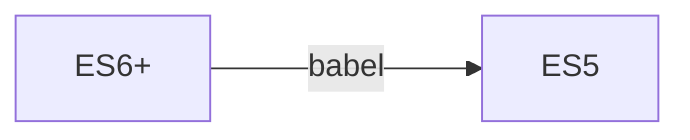

# 背景

> `webpack`静态模块化打包工具。无论是前端工程化，还是高级前端岗位都是绕不开的话题之一，面试经常问到构建优化的的方案，自定义`loader`，自定义`plugin`等。无论是进阶，还是面试高级岗位，在这里你都可以找到答案。`webpack`简单来说就是各种令人眼花缭乱的配置，笔者也是感同身受，学了很快就会忘记，所以才有了这篇文章。采用`费曼学习法`，用简洁的思想和简单的语言向大家表达出来，帮助大家也是帮助自己，本文的学习资料大部分来自于官方文档。本文将持续迭代，收藏`===`学会～


## 安装
```shell
pnpm init
# 安装依赖
pnpm i webpack webpack-cli -D
```
## 结构划分
代码仓库：https://github.com/GetWebHB/webpack-advanced
- 每一个小的章节，都会存放在对应的文件夹中（例：`0.start`），文件夹会存放对应的**配置文件**,**源代码**，**产物**。打包命令如下所示，`npm run build`
```js
// src/0.start/package.json
"scripts": {
  "build": "webpack",
},
```
`scripts`脚本，本质上就只在`.bin`文件夹下寻找webpack, 即`npm run build`等同于`npx webpack`，默认会去存在`package.json`(即根目录查找配置文件`webpack.config.js`) ，它的`filename`可以更改,`--config filename`即可。**只要修改了配置文件，就需要重启服务** 
**目录结构**
```
├── README.MD
├── package-lock.json
├── package.json
└── src
    ├── 0.start
    │   ├── build
    │   │   └── bundle.js
    │   ├── package.json
    │   ├── pnpm-lock.yaml
    │   ├── src
    │   │   └── main.js
    │   └── webpack.config.js
```
`src`下是每个小节的代码，`cd`当前的小节，执行`pnpm install / npm run build`即可
## 起手式
本节代码见：`0.start`

```js
// main.js
function sayHi() {
  console.log('hi ice 24')
}
sayHi()
export { sayHi }

// webpack.config.js
const { resolve } = require('path')

module.exports = {
  entry: './src/main.js',
  output: {
    path: resolve(__dirname, 'build'),
    filename: 'bundle.js',
  },
}

```
- 简单走读一下，`cjs`的方式导出了一个对象
1. `entry`代表入口，默认情况下相对路径为`package.json`存在的目录
2. `output`代表出口，即产物打包后的位置，同样是绝对路径，打包到`build`的文件夹下，文件名为`bundle.js`
3. `npm run build`, 即打包产物，就会发现该目录下出现了产物
## mode&devtool
本节代码见：`1.mode_devtool`  
上一小节中，我们学习到了`entry`,`output`这两项配置，这一章节中，我们学习`mode`和`devtool`  
### mode
概述：告诉webpack使用相应模式的内置优化  
当我们执行`npm run build`的时候，`webpack`会有这一串警告，说我们没有设置`mode`

那什么是模式（即`mode`）,从提示看说我们可以设置为`development`or`production`   
**传送门**：https://webpack.js.org/configuration/mode/


mode也是最重要的优化，`webpack`都会帮我们做好。接下来我们来一一了解对应模式展示的不同行为
- `mode` = `'none' | 'development' | 'production'(default)`
```js
// main.js
const mes = 'hi ice 24'
function sayHi() {
  console.log(mes)
}
sayHi()

export { sayHi }
```
#### none 
**产物分析**


- 我们大致扫一眼即可

#### development
我们平常使用的`cli`, `vue/cli`(维护阶段)，`create-react-app`等，反正所有底层使用`webpack`的，`npm run serve / npm run start`这种在本地开启服务的，采用的策略都是使用`development`，主打的就是一个快，不需要通过一些`plugin`，例如`terser`（后面会讲）丑化压缩代码  
**产物分析**

从注释中我们可以得知，它使用`eval`函数可以在浏览器的开发工具中创建一个单独的源文件，在或者说`devtool`:`false`的时候就会移除（`source map`），那么创建一个单独的文件可以干嘛呢？可以映射到代码报错的位置，这也是`devtool`配置项的作用，我们后面会详细探讨。
#### production

就是那么朴实无华，甚至连`函数`都帮你执行了，直接打印出结果
### devtool
概述：是否生成，控制如何生成source map(源码映射)，不同的值会明显影响到构建(build)和重新构建(rebuild)的速度。  
**默认值**
- `dev: eval`  
- `prod: none`  
**传送门**：https://webpack.docschina.org/configuration/devtool/


这幅图比较重要，介绍了该配置项的性能怎样，是否使用于`production`中，以及构建的速度如何
- 在`mode`模式为`development`中，我们看见了`eval`函数，可以映射出代码的错误位置信息，即配置为`mode: "eval"`，现在让我们来深入探讨一下`devtool`  

就拿`mode:prod`来说，我们发现代码是已经被丑化过，编译后的产物，如果在测试阶段，代码发生了错误压根不知道代码出错在哪里，那我们如何`debug`呢？这正是`source map`的作用，编译后的产物 ->（映射）源代码的位置   
#### false
```js
// main.js
const mes = 'hi ice 24'
function sayHi() {
  console.log(mes)
}
console.log(age) // age is not defined
sayHi()

export { sayHi }

// bundle.js
(()=>{"use strict";console.log(age),console.log("hi ice 24")})();
```
跑到浏览器上（测试阶段），我们可以看到错误信息，但是却看不到代码详细出错在第几行，这在一个庞大的项目中，是非常致命的（即`devtool: false`）,不开启`source map`


#### eval
使用`eval`函数可以在浏览器的开发工具中创建一个单独的`source map`

#### source-map
当我们配置改为它，我们先看下产物


会多出来一个.map的文件，即源码映射文件，最后一行代表着引用哪个.map文件，接下来我们在到浏览器下看下行为。


竟然神奇的映射出来了源代码的位置（第几行，甚至第几个字符），非常的神奇是吧

  
接下来，让我们继续深入探究，简单看下`map`文件


- version：3，从之前1，2的版本构建出来的map文件有点大，随着不断的迭代构建出来的`.map`文件也越来小
- file：映射的源文件（转换后的源文件）
- mappings：记录位置信息的字符串（VLQ编码）
- sources：源的路径
- sourcesContent：源代码的内容
- names：转换前的所有变量名和属性名
- sourceRoot：映射目录的位置，为根目录

#### 最佳实践
- prod：`none(默认) | false`
- test：`source-map`
- development: `source-map`

## babel
本节代码见：`2.babel`  
babel你可能不太了解（因为`cli`全部帮我们做好了,配置`presets`），但是它现在是前端工程化必不缺少的一部分，它的本质就是一个
**编译器**，把A源代码转换为B源代码。更通俗的说：把`ES6+`的代码转换为`ES5`的代码，可以适配版本更低的浏览器




过程大致分为3个阶段
1. 解析阶段
    - 词法分析，语法分析，生成ast树（抽象语法树）
2. 转换阶段
    - 转换为新的ast树
3. 生成阶段

### 基础使用
基础使用，我们不再讲解，直接看官网即可，还是比较简单的，它可以在终端直接使用，因为提供了对应的`CLI`工具
- 传送门：https://babel.docschina.org/docs/usage
### webpack中使用
```js
// main.js ES6代码
let mes = 'hi ice'
console.log(mes.toUpperCase())
console.log(mes.slice(0, 2))

const double = [1, 2, 3].map((num) => num * 2)
console.log(double) // [2,4,6]
```
安装开发时依赖，插件作用分别是  
1. 转换箭头函数
2. 转换块级作用域
3. 以及babel-loader
4. `@babel/core`不需要安装，因为`loader`中存在关联会被下载下来
```shell
pnpm i @babel/plugin-transform-arrow-functions @babel/plugin-transform-block-scoping babel-loader -D
```
走读一下配置，`module`中`rules`，匹配`js`文件，采用`loader`进行转换,
`options`里可以写`babel`的配置，也可以单独抽成一个独立的文件（`babel.config.js`）
```js
// webpack.config.js
const { resolve } = require('path')

module.exports = {
  mode: 'production',
  entry: './src/main.js',
  output: {
    path: resolve(__dirname, 'build'),
    filename: 'bundle.js',
  },
  module: {
    rules: [
      {
        test: /\.js$/,
        loader: 'babel-loader',
        options: {
          // ...一些配置
        },
      },
    ],
  },
}
```
使用`plugins`进行源代码代码转换
```js
// babel.config.js
module.exports = {
  plugins: ['@babel/plugin-transform-block-scoping', '@babel/plugin-transform-arrow-functions'],
}
```
执行`npm run build`查看打包的产物就会发现已经转换好了  
那么当我们高级语法有很多很多，比如`promise async await`等，我们难道一个一个去安装插件吗，这样显得太繁琐了，所以这个时候`preset`（预设）就登场了，提前把那些高级特性全部帮我们设置好
```shell
pnpm i @babel/preset-env -D
```
```js
// babel.config.js
module.exports = {
  presets: ['@babel/preset-env'],
}
```
接下来，在执行`npm run build`,效果一样，但是已经帮我们设置好了预设，高级语法都会被打包成低版本的代码，那提前帮我们安装了哪些插件呢？
详见：https://babel.docschina.org/docs/babel-preset-env  
`@babel/preset-env` 其中的`env`即是根据环境查询兼容性（`browserslist`）后面我们会讲解到
### polyfill
polyfill(补丁)，前面我们说到`preset-env`，可以把我们使用的高级语法，打包成更多浏览器适配的语法，但是对于某种`API`，不存在的情况它是无能为力的。比如`replaceAll` **ES2021**提出的，而`polyfill`就会帮我注入对应的`API`

**未使用polyfill**


我们能非常直观的观察到，该`replaceAll`,直接被构建出来了，但是在低版本的浏览器上肯定是没有这个`API`的，就会出现类似的错误`Uncaught TypeError: mes.replaceAll is not a function`,笔者在实际生产中(微信浏览器上)，遇到了类似的`bug`，我们应该如何解决呢？    
**前置知识**  
```shell
pnpm i core-js regenerator-runtime
```
注意不是开发时依赖，因为它实际要被我们注入到代码当中，其中这两个包代表用于模拟完整的 `ES2015+` 环境  
#### 1. 直接引入API
我们可以根据实际需要直接引入对应的`API`即可，好比上方的`replaceAll`,我们知道它是较新的语法，直接从`core-js`引入即可
```js
// main.js
import 'core-js/es/string/replace-all'
```
进行打包，然后我们再次在分析下产物,对应的`API`就被注入到我们的产物当中，就实现了`polyfill`


#### 2.useBuiltIns

```js
// babel.config.js
const path = require('path')
module.exports = {
  presets: [
    [
      '@babel/preset-env',
      {
        corejs: 3,
        useBuiltIns: 'usage',
        modules: 'cjs',
      },
    ],
  ],
}
```
`useBuiltIns: usage | entry | false(default)`  
`usage`就是你有使用哪些，`entry`包含`node_modules`的第三方库使用的，根据实际情况选择即可，但是一般使用`usage`,因为这些`polyfill`都会被实际注入到代码中会影响构建产物的大小  
`corejs:3` 代表第三个版本  
`modules`默认是`auto`,但实际在我的`Mac`上，会报错不支持`cjs`的问题，所以我改了下，有可能在`windows`不需要配置，这点还没测试过。**如果你使用了高级特性，但是代码没有`polyfill`,请看下个章节`browserslist`,在那里你会找到答案（把市场占有率调低一些比如 > 0.1%）**
## browserslist
本节代码见：`2.babel`  
在谈起浏览器的兼容性，`browserslist`一定是前端必不可少的工具，早期无论是处理`css`(添加浏览器前缀)，还是`ES6+ -> ES5`。好比，我们针对的用户都是一些大学生，普遍这些用户电脑上的浏览器都是较新的，那这些浏览器本身就支持`ES6+`的语法，我们就没有必要去转换为`ES5`的代码，我们来简单介绍一下它

```
pnpm i browserslist -D
```
我们在根目录下新建文件`.browserslistrc`
```js
// .browserslistrc
> 1% //市场占有率 > 1%
last 2 versions // 最后两个版本
not dead // 还在维护的
```
此时，我们执行`npx run browserslist`

在控制台打印出来了，适配的浏览器版本。这里的版本代表的是区间`chrome109 - chrome 120`，那么疑问就来了，它是怎么知道要适配哪些浏览器呢？其实是上方的配置文件在影响  
`postcss` / `babel`它们兼容性的都是通过`browserslist`工具，然后`browserslist`是通过`can i use`网站，查询适配的


## 打包React代码
本节代码见：`3.build_react`  
前面我们讲过可以通过`babel`打包`js`语法，
而`react`使用的是`jsx`代码。`jsx`其实是`js`代码的扩展，加了一些特定的语法而已
- 以前：`jsx`通过`babel`打包成`react.createElement`,所以说`jsx`其实是`react.createElement`的语法糖
- `v18`后，本质是从`react/jsx-runtime`引入的`jsx`


我们了解到这里即可，因为如果没有`jsx`语法，我们写嵌套的结构简直是噩梦。  
直观感受下`Count`组件，所以才需要`jsx`语法，更接近`html`让我们更容易上手


### 编写React应用
```
pnpm i react react-dom
```

```jsx
//Counter.jsx
import React, { memo, useState } from 'react'

const Counter = memo(() => {
  const [count, setCount] = useState(0)
  return (
    <div className='count'>
      <button onClick={() => setCount(count + 1)}>+1</button>
      <span style={{padding: '0 8px'}}>{count}</span>
      <button onClick={() => setCount(count - 1)}>-1</button>
    </div>
  )
})

export default Counter

// App.js
import React from 'react'
import { createRoot } from '../node_modules/react-dom/client.js'
import Counter from './components/Counter.jsx'

const root = createRoot(document.getElementById('root'))
root.render(<Counter />)
```
就是一个简单的计数器代码，但是笔者遇到一个比较奇怪的问题，就是默认引入`react-dom/client.js`的时候，没有向上查找（`node_modules`），所以这里写了相对路径，效果如下

  暂时没定位出来哪里的问题，如果知道的同学可以指点一下, 接下来我们应用就就好了，我们执行`build` 
### 使用babel-loader
**错误：不支持jsx**


报错信息：告诉我们需要一个合适的`loader`来处理`jsx`类型的文件,因为我们之前使用`loader`,`rules`规则中并没有匹配它，`webpack`不知道如何去解析它  
**解决办法**
```js
// webpack.config.js
module: {
  rules: [
    {
      test: /\.jsx?$/,
      loader: 'babel-loader',
    },
  ],
},
```
正则`?`代表1个或者0个，告诉它使用`babel`进行处理，然而它也需要许多插件对`jsx`代码进行支持，因为`plugin`过于繁琐，我能直接使用预设即可

```shell
pnpm i @babel/preset-react -D
```

```js
module.exports = {
  presets: ['@babel/preset-env', '@babel/preset-react'],
}
```
再次执行`npm run build`我们就发现代码已经打包成功,，但是这里还差最后一步，我们在编写`jsx`代码的时候，是要把`react`应用挂载在`#root`上的，但是我们现在并没有`html`文件。当然我们也可以手动创建，但是这样太过于繁琐。我们可以使用另外一个插件，直接把产物挂载到`html`上即可
### html-webpack-plugin
```
pnpm i html-webpack-plugin -D
```
```html
<!DOCTYPE html>
<html lang="en">
  <head>
    <meta charset="UTF-8" />
    <meta name="viewport" content="width=device-width, initial-scale=1.0" />
    <title>React App</title>
  </head>
  <body>
    <div id="root"></div>
  </body>
</html>
```
```js
// webpack.config.js
const HtmlWebpackPlugin = require('html-webpack-plugin')
module.exports = {
  // ...
  plugins: [
    new HtmlWebpackPlugin({
      template: './index.html',
    }),
  ],
}
```
`build`以后就发现已经构建完毕，我们利用`live server`开启一个本地服务预览，后面我们还会讲解开启一个本地服务，热更新等，构建一个小型的开发环境  
  
一个简单的计数器`React`应用，我们就构建好啦～


## devServer
本小节见`4.webpack_dev_server`  
上一小节中，我们说到打包`react`应用，但是需要我们手动进行`build`，但是在实际开发中，肯定不可能这样，每次修改一次代码，就`build`一下，所以我们要像一些常规的`cli`一样，开启一个本地服务进行开发      
**安装**
```shell
pnpm i webpack-dev-server -D
```
```js
// package.json
"scripts": {
  "start": "webpack server",
},
```
**启动**

`npm run start`这样就开启了一个服务了，端口在8080，我们直接打开这个地址即可,同时也会进行热更新


### static
#### 演练场
我们启动的这个服务，不像`build`,它是实实在在的文件，而我们开启的本地服务内容都是在内存当中的，其中打包的静态资源，一般都需要存放到`public`文件夹中。
**错误演练**


从上面内容，我们可以得知，`avatar.jpg`请求的地址，正是我们开启服务的地址，但是这个地址的内容都是存在于内存当中，即使我们在目录下存放了图片文件，该服务不知道从哪里去寻找  
**解决办法**


- 我们修改一下`avatar`的存在目录即可，把它修正到`public`文件夹中即可
```tsx
const Profile = memo(() => {
  return (
    <div>
      avatar1:  <br/>
      avatar2: 
    </div>
  )
})
```
`avatar1`是走的相对路径，`avatar2`，`/avatar`代表的从根目录进行查找，最后它两都是从`8080`端口下访问资源，那为什么是`public`文件夹呢，不是`abc`呢

#### 配置详解
- default（public）
    - 它的默认值为`public`所以在这个文件夹下的资源，可以被访问到，如果想要改成其他文件夹，直接修改配置即可
    ```js
      devServer: {
        static: ['public', 'abc'],
      },
    ```
    如果是一个数组，那么它们两个文件夹都会起作用
### open
- 自动打开浏览器窗口
### port
- 修改端口号
### compress
- 开启`gzip`压缩，效果如下

### proxy
在我们日常开发中，经常会遇到跨域的问题，解决方案有很多种
- 生产阶段
    - 通过`nginx`进行反向代理来解决跨域问题
    - 后端开启CORS
        - Access-Control-Allow-Origin: *
- 开发阶段
    - 后端开启CORS
    - 利用`devServer开启Proxy`，本文重点讲解，其他大家自行了解
#### 后端服务
本节代码见：`koa`  
我们采用`Koa`编写
```shell
pnpm i koa koa-router
```
```js
const Koa = require('koa')
const Router = require('koa-router')

const app = new Koa()
const userRouter = new Router({ prefix: '/users' })

userRouter.get('/', (ctx, next) => {
  const users = [
    {
      name: 'ice',
      age: 24,
    },
    {
      name: 'panda',
      age: 23,
    },
  ]

  ctx.body = users
})

app.use(userRouter.routes())
app.listen(3000, () => {
  console.log('服务启动成功')
})
```
#### 前端代码
```jsx
import React, { memo, useEffect,useState } from 'react'
import axios from 'axios'

const Users = memo(() => {
  const [list, setList] = useState([])
  useEffect(() => {
    axios.get('http://localhost:3000/users').then(res => {
      setList(res.data)
    })
  }, [])

  return (
    <div>
      <h4>Users:</h4>
      <ul>
        {list.map(({name, age}) => {
          return <li key={name}>{name}-{age}</li>
        })}
      </ul>
    </div>
  )
})

export default Users
```
当我们访问浏览器就会看到这样的错误


这正是跨域的错误，因为我们的前端服务开启在`8080`端口上，而后端的`api`服务开启在`3000`上，我们不能进行访问，这个是浏览器的限制，违背了同源策略，那么我们如何解决这个问题呢？

#### 解决办法
1. 后端解决开启`CORS`
```js
  ctx.set('Access-Control-Allow-Origin', '*')
```
2. 利用`proxy`开启代理
```js
// webpack.config.js
proxy: {
  '/api': {
    target: 'http://localhost:3000',
    pathRewrite: {
      '^/api': '',
    },
  },
},
```
```js
axios.get('/api/users').then(res => {
  setList(res.data)
})
```
当我们以`/api`开头的，就会被代理到`proxy`中，而它是使用的`http-proxy-middleware`，是它开启的服务去我们`3000`端口请求数据，拿到数据以后在通过它返回给客户端这样就完成了代理，而`pathRewrite`是正则匹配，把以`/api`开头的，我们给它替换为空地址，最后拼接而成的就是后端`api`的地址
```js
// before
// /api/users

// after
// http://localhost:3000/users
```
**proxy原理**：中间人模式


#### changeOrigin
改变`host`的来源,有些服务器会根据`host`来源来判断，如果不是同一个host访问就给他屏蔽掉，防止爬虫。  
在`koa`服务器中，我们打印出它的`header`,就会发现请求的`origin`地址，也就是我们的前端地址`8080`。如果想要改变它的源，配置如下就可以解决


```js
proxy: {
  '/api': {
    // ...
    changeOrigin: true,
  },
},
```
因为正常情况下，我服务器在`3000`端口下，那么请求的`host`也应该在`3000`,这个最主要看后端是否有限制

### historyApiFallback
前端路由，都是一个`url -> components`，我们会在`url`上增加前端路由，然后渲染对应的组件，但是在浏览器中则会代表请求对应的资源，一般为`index.html`文件，刷新网页就会报一个`404`找不到文件的错误

  
那么我们如何解决呢？我们刷新网页的时候在给它重定下`index.html`文件即可
```js
devServer: {
  historyApiFallback: true,
},
```
## 多入口起点
本节代码见：`5.entry_points`  
我们前面就配置了`entry`，指向的`main.js`，当执行`build`,`webpack`就会从它出发，把有关联的代码形成一个依赖图（图结构），打包构建，而之前的`mode`中，我们只配置了单入口，其实是可以设置多入口起点的，不过日常使用的较少（`vite/create react app`都是单入口），我们了解即可  
### 创建文件
```js
// src/stu.js
console.log('stu')

// src/teacher.js
console.log('teacher')
```
此时，我们的`src`文件中，有两个文件，它们彼此并没有依赖，我们设置给他们两个都设置为入口文件
```js
// webpack.config.js
module.exports = {
  // ...
  entry: {
    stu: './src/stu.js',
    teacher: './src/teacher.js',
  },
  output: {
    filename: 'bundle.js',
    path: resolve(__dirname, 'build'),
  },
}
```
### 文件打包
`entry`为对象的写法，我们可以配置多个入口，此时我们执行`build`，会发现如下错误，有多个`chunk`名字相同产生了冲突，它不知道如何打包了，其实学到这里，大家肯定知道应该要设置`output`（即出口配置）

```js
output: {
  filename: '[name]_bundle.js',
  path: resolve(__dirname, 'build'),
},
```
现在执行`build`就可以发现打包成功了，其中`[name]`写法为`placeholder`（占位符语法）


### 依赖共享
如下图所示，我们在日常开发中，会有一些包会在很多文件中使用，比如`dayjs`在`stu teacher`文件中均有用到
```js
// src/stu.js
import dayjs from 'dayjs'

console.log('stu')
console.log(dayjs().format('YYYY-MM-DD HH:mm:ss'))

// src/teacher.js
import dayjs from 'dayjs'

console.log('teacher')
console.log(dayjs().format('YYYY-MM-DD HH:mm:ss'))

```
然后我们进行`build`观察如下产物，会发现`dayjs`竟然会被打包两次（即`第10行`）


那么我们针对如上的场景如何优化呢？能不能把`库`文件单独打包到一个文件里面，然后让这两个文件应用这两个包呢？
```js
entry: {
  stu: {
    import: './src/stu.js',
    dependOn: 'shared',
  },
  teacher: {
    import: './src/teacher.js',
    dependOn: 'shared',
  },
  shared: ['dayjs'],
},
```
我们在另外增加一个入口，让`stu & teacher`去引入这个需要共享的第三方包，这样就可以实现，我们再次观察产物,就可以看见实现了对`shared`包进行了引入


## 动态导入
本节代码见：`6.dynamic_import`  
其实动态导入大家应该都用过，就是路由懒加载。Vue中利用`import`函数导入组件或者`React`中的`React.lazy`的函数引入的组件。何为路由懒加载？最主要的就是映射关系， `path: component`,有`history/hash`两种模式，监听路由的变化，动态加载`component`  
那么当浏览器首次渲染的时候，只需要下载对应`js`文件即可（不需要全部下载），有利于提高首屏渲染速度。当浏览器闲置的时候下载，或者使用到的时候在下载即可（路由变化）
### 基本用法
```js
// main.js
const btnEl1 = document.createElement('button')
const btnEl2 = document.createElement('button')

btnEl1.textContent = '加载stu'
btnEl1.addEventListener('click', () => {
  import('./stu').then((res) => {
    console.log(res)
  })
})

btnEl2.textContent = '加载tea'
btnEl2.addEventListener('click', () => {
  import('./teacher').then((res) => {
    console.log(res)
  })
})

document.body.append(btnEl1, btnEl2)
```
当我们执行`build`的时候，就会发现`stu`和`tea`是打成单独的包的，通过某种行为，动态的加载

  
当我们开启一个本地服务，首次加载的只有`bundle.js`

  
当我点击按钮，触发了某种行为的时候，才会加载动态导入的文件


### 魔法注释
我们前面进行了动态导入，但是仔细看它的名字`src_stu_js.bundle`,是根据它的目录+filename生成的，但是实际`cli`中，都会是对应的页面名称，此时我们就需要用到魔法注释了
```js
btnEl2.addEventListener('click', () => {
  import(/* webpackChunkName: 'teacher' */'./teacher').then((res) => {
    console.log(res)
  })
})
```
此时，我们就可以发现名称已经改掉了


### prefetch/preload
- **预获取（prefetch）** ：将来某些导航下可能需要的资源  
- **预加载（preload）**：当前导航下可能需要的资源
#### 差别
- 预加载的`chunk`会在父`chunk`加载时并行开始加载，预获取`chunk`则会在父`chunk`加载结束后开始加载
- 预加载`chunk`具有中等优先级，而预获取`chunk`则在浏览器闲置时下载
#### 实践
增加：`/* webpackPrefetch: true */`

我们可以从浏览器看到，`teacher`的`chunk`会在父`chunk`加载完，就立即获取，随后当我们触发动态导入操作的时候，它会从`cache`中获取文件


`preload`不正确地使用 `webpackPreload` 会有损性能，请谨慎使用，笔者就不再演示

## optimization
本节代码见：`7.optimization`
### splitChunks
在我们实际构建的产物，往往第三方包(即`vendors`)和我们自己编写的代码都是分开打包的，一般会构建为两个文件
```js
// main.js
import dayjs from 'dayjs'

console.log(dayjs('YYYY-MM-DD HH:mm:ss'))
console.log('ice')

```
这是我们不处理构建的产物，无论是第三方库，还是我们编写的代码都在`bundle.js`文件，现在看起来无伤大雅，但是依赖多了，随着`bundle`文件越来越大，那么意味着下载的也慢，首屏渲染速度也会下降。所以，我们才要把他们分开存放


我们走读一下配置，其中`all`代表，可在同步与异步（异步：动态导入）之间共享`chunk`,`minSize`代表生成`chunk`的最小体积，如果比这个`1kb`还小的话，就直接不分开打包，
`defaultVendors`设置产物的名称
```js
//webpack.config.js
const { resolve } = require('path')
const htmlWebpackPlugin = require('html-webpack-plugin')

module.exports = {
  optimization: {
    splitChunks: {
      chunks: 'all',
      minSize: 1 * 1024,
      // 自定义分包
      cacheGroups: {
        vendors: {
          test: /[\\/]node_modules[\\/]/,
          filename: 'vendors.bundle.js',
        },
      },
    },
  },
}
```
接下来我们来查看下产物，我们编写的代码，在`bundle.js`中，而第三方的在`vendors`中


### chunkIds
当我们不设置`output`输出的文件名且在`development`模式下，那么它将使用绝对路径进行命名，如下图所示

但是它的文件名生成算法大有来头，配置即`chunkIds`,`dev`环境采用的是`named`,而`prod`的阶段采用的是`deterministic`（在不同的编译中不变的短数`id`。有益于长期缓存。在生产模式中会默认开启。）  
编译结果如下图所示：  


## CDN
**本节代码见：`8.cdn`**  
我们构建的产物，最后是要被部署到服务器上的，但是对于这种物理设备会存在地域的限制，往往服务器离用户近的越近的，相对来说访问的速度越快，所以才有了CDN，把静态资源部署到CDN服务器上，也是性能优化的策略之一  
一般把`index.html`直接部署到服务器上，而那些资源`js/css`等，应该存放在CDN上，选择也还是存在于服务器上，那么怎么修改呢？

### publicPath
```js
// webpack.config.js
module.exports = {
  output: {
    publicPath: 'https://cdn.com', // 示例地址
  },
}
```
构建打包效果如下：


### 打包第三方库
对于`CDN`服务器来说，往往比普通的服务器更贵，小型公司选择性的可能性不大，而对于那种第三包库而说都会有开源的`CDN`平台，[bootcdn](https://www.bootcdn.cn/)，众多知名的库都会托管在这里。
比如，我们想要`dayjs`使用CDN进行加速，而不是打包在我们的源代码中  
**首先进行排除**，externals中`key:value`代表不同的意义，`key`是引入包的名字（`from x`）,而`value`是`cdn`库的链接导出的名字
```js
// webpack.config.js
module.exports = {
  externals: {
    dayjs: 'dayjs',
  },
}
```
在html模版中引入即可


## CSS单独打包
我们知道，从浏览器的渲染原理可以得知`css`是可以并行加载的，不会阻塞后面代码的执行，`dom+css`解析完成形成一个`render tree`在经过`layout paint`最后显示到浏览器上，而在不配置`css`单独打包，会打包到`js`代码里，会增加`js`包的大小，影响首屏渲染的速度
### 默认
```js
// webpack.config.js
module: {
  rules: [{ test: /\.css$/, use: ['style-loader', 'css-loader'] }],
},
```
```css
/* style.css */
body {
  background: skyblue;
}
```
```js
// main.js
import './style.css'
console.log('ice')
```
我们执行`build`，会发现`css`代码是打包到`js`代码当中的，通过`style-loader`把`css`插入到`head`当中


### 单独打包
```shell
pnpm i mini-css-extract-plugin -D
```

```js
// webpack.config.js
const MiniCssExtractPlugin = require('mini-css-extract-plugin')

module.exports = {
  module: {
    rules: [{ test: /\.css$/, use: [MiniCssExtractPlugin.loader, 'css-loader'] }],
  },
  plugins: [
    new MiniCssExtractPlugin({
      filename: 'css/[name]_[hash:6].css',
    }),
  ],
}
```
使用`mini-css-extract-plugin`提取`css`，把`css`提取成单个文件，我们执行`build`在观察产物，资源就被我们提取出来了


### 丑化Css
**不使用丑化**，对于一些换行符，空格之类的它实际会占代码体积的，我们可以把它进行丑化，删除一些无用的空格和换行

**使用之后**
```js
// webpack.config.js
const CssMinimizerPlugin = require('css-minimizer-webpack-plugin')

module.exports = {
  mode: 'development',
  optimization: {
    minimize: true,
    minimizer: [new CssMinimizerPlugin()],
  },
}
```

我们就可以清晰的看见`css`被丑化了，`minimize`代表启动`minimizer`,而在`prod`模式下，默认为`true`


## Terser
**本节代码见：`10.terser`**  
terser工具，在`mode`为`prod`环境的时候，会自动应用。那它是什么呢？它用于丑化`js`代码，什么是丑化呢？我们平常使用的第三方库都会有以`min.js`结尾的就是丑化之后的代码。而它由`mangler and compressor`两部分组成  
比如:`dayjs.min.js`，如下图所示

那为什么需要把它丑化呢？对于我们开发的时候，我们都需要做到“见名知意”，但是对于用户来说，**它无需关系变量名，存不存在换行等**，因为这样可以大大减少代码的体积，更快的在`http`中进行传输，更快的传输给用户，加载首评渲染速度等一系列好处。
### CLI中使用
**本节代码见：`1.CLI`**

```shell
pnpm i terser -D
```
```js
// main.js
const sum = (n1, n2) => n1 + n2

function bar() {
  console.log('bar')
}
```
```js
// package.json
"scripts": {
  "build": "terser main.js -o mini.min.js -m --toplevel",
}
```
我们简单走读一下配置  
1. `terser main.js` 编译该文件  
2. `-o` 输出为`mini.min.js`
3. `-m` mangle（乱砍）把变量名砍断,变量名简写`即getUserName ->缩短为一个字符 x`
4. `--toplevel` 顶层作用域的名称进行 压缩/砍断  
[...更多配置   ](https://terser.org/docs/cli-usage/)  

我们执行`npm run build`,观察一下产物信息，发现代码就被我丑化了


### webpack中使用
**本节代码见：`2.webpack`**  
前面我们有说到过，当我们模式为`prod`的时候，会自动使用`terser-webpack-plugin`这个插件，而我们可以进行自定义，一般我们使用默认即可，我们首先来看下`prod`模式下，打包后的产物，它是正常进行压缩的

接下来，我们来设置一些配置，对它了解的更加深刻
```js
// webpack.config.js
  optimization: {
    minimize: true,
    minimizer: [
      new terserWebpackPlugin({
        extractComments: false, // 提取注释
        terserOptions: {
          mangle: true, // 字母缩写
          compress: {
            // 未使用的不打包
            unused: false,
          },
        },
      }),
    ],
  },
```
1. `minimize` 使用`minimizer`自定义的`terser`或者默认的`TerserWebpackPlugin`
2. `extractComments` 是否把注释提取为单独的文件
3. `mangle` 字母缩写
4. `unused` 未使用的包，不打包

## webpack的配置抽取
**本节代码见:**`11.webpack_merge_config`  
至今为止，我们已经学了很多的配置项了，但是我们的模式是混乱的，有些应该存在于`prod`环境下，而有的应该在`dev`模式下，现在我们就进行抽取

### 前置知识
我们要区分`mode`,首先我们要让`webpack.config.js`中，知道我们执行`build`处于`prod`模式，而`start`处于`dev`模式下
```js
// package.json
{
  "scripts": {
    "start": "webpack server --config ./config/index.config.js --env development",
    "build": "webpack --config ./config/index.config.js --env production"
  },
}
```
我们执行对应的命令，`--env`传入现处的模式，那我们在哪里接受呢？其实我们写的`webpack.config.js`不仅可以接受一个对象，还可以接受一个函数，`webpack`就会执行这个函数，并把`env`的环境传递给我们
```js
module.exports = function (env) {
// const isProd = env.production
}
```

### 核心思路
1. 执行`start/build`区分对应的环境
2. 把文件分离出来,把对应的配置写到对应的`mode`下
    - index.config.js
    - dev.config.js
    - prod.config.js
3. 利用`webpack-merge`进行组合

**源代码**
``` js
// index.config.js
const { resolve } = require('path')
const { merge } = require('webpack-merge')
const htmlWebpackPlugin = require('html-webpack-plugin')
const MiniCssExtractPlugin = require('mini-css-extract-plugin')

const prodWebpackConfig = require('./prod.config')
const devWebpackConfig = require('./dev.config')

const getCommonConfig = (isProd) => {
  return {
    entry: './src/main.js',
    output: {
      filename: 'js/[hash:6]_bundle.js',
      path: resolve(__dirname, '../build'),
      clean: true,
    },
    module: {
      rules: [{ test: /\.css$/, use: [isProd ? MiniCssExtractPlugin.loader : 'style-loader', 'css-loader'] }],
    },
    plugins: [
      new htmlWebpackPlugin({
        template: './index.html',
      }),
    ],
  }
}

module.exports = function (env) {
  const isProd = env.production
  const config = isProd ? prodWebpackConfig : devWebpackConfig

  return merge(getCommonConfig(isProd), config)
}

// dev.config.js
module.exports = {
  mode: 'development',
  devServer: {
    open: true,
    port: 3000,
    compress: true,
    static: ['public', 'abc'],
    proxy: {
      '/api': {
        target: 'http://localhost:3000',
        pathRewrite: {
          '^/api': '',
        },
        changeOrigin: true,
      },
    },
    historyApiFallback: true,
  },
}

// prod.config.js
const MiniCssExtractPlugin = require('mini-css-extract-plugin')
const CssMinimizerPlugin = require('css-minimizer-webpack-plugin')
const TerserWebpackPlugin = require('terser-webpack-plugin')

module.exports = {
  mode: 'production',
  plugins: [
    new MiniCssExtractPlugin({
      filename: 'css/[name]_[hash:6].css',
    }),
  ],
  optimization: {
    minimizer: [new CssMinimizerPlugin(), new TerserWebpackPlugin()],
  },
}
```

## Tree Shaking
**本节代码见：`12.tree_shaking`**  
“摇树”，把代码中的`dead code`不打包在产物中，我们前面说到的`terser`可以实现部分`tree shaking`的效果，即顶层作用域中没使用到的"函数"，变量等。为了实现演示效果，我们把`prod.config.js`的`mode`改为`dev`模式，避免应用了一些插件影响我们。`tree shaking`依赖于`ES Module`的静态语法分析,要使用`ES Module`进行导出 
### usedExports
如下图所示，我们其中的`sum&info`都是没有使用过的

当我们没有使用`terser`,就会发现，我们构建的产物中，还会存在`dead code`这些死的代码，这样会增加代码的体积

当我们使用`terser`就会把没使用过的代码（即顶层作用域）去除，为什么说是顶层呢？模块就不可以吗?
```js
// service/getUserName.js
function getUserName() {
  return 'ice'
}
export default getUserName

// main.js
import './style.css'
import { getUserName } from './service/getUserName'

const sum = (a, b) => a + b
const info = { name: 'ice', age: 24 }
```
我们执行`build`观察产物，会发现**并没有被删除掉**，是因为`terser`并不知道这个模块有没有被使用，需要结合`usedExports`

**usedExports做了什么事情？**  
首先我们为了查看效果，先不要使用`terser`，避免干扰到我们,`build`观察一下产物

```js
optimization: {
  usedExports: true,
},
```
应用`usedExports`后，我们在进行`build`,就会多了一行魔法注释,在结合`terser`,`terser`就可以大胆的将这个模块移除了

我们放开`terser`再次`build`导出却没有使用的代码就被移除了


### sideEffects
它会跳过整个模块/文件，直接查看该文件是否有副作用
```js
// package.json
"sideEffects": false,
```

```js
import './style.css'
import { getUserName } from './service/getUserName'

const sum = (a, b) => a + b
const info = { name: 'ice', age: 24 }

console.log(sum, info)
```
```js
function getUserName() {
  return 'ice'
}
// 增加副作用代码
window.info = {
  name: getUserName(),
  age: 20,
}

export default getUserName
```
如果为`sideEffects`为不保留副作用代码，那么没有使用到的代码模块（文件）将直接被删除，但是这些副作用代码有可能会被用到，那么代码就会报错  
`style.css`也不会被打包
```js
// package.json
  "sideEffects": ["*.css", "getUserName.js"],
```
把需要保留的`副作用`模块，写入到数组中即可

## **Scope Hoisting**
**本节代码见：`13.scope_hoisting`**  
**概念**  
早期webpack中模块都会被包裹在单独的函数闭包中，这些包裹的函数使`js`在浏览器中执行速度变慢，相比像`rollupjs`就会把所有的模块作用域“提升”合并到一个闭包中，这就称之为“作用域提升”  
前面我们有提到，当`mode`为生产环境的时候默认，会给我们默认使用许多“优化手段”，提升作用域也是应用的一个`plugin`,我们改为`dev`来测试一下这个plugin（即`ModuleConcatenationPlugin`）

### 不使用
```js
// sub.js
const sub = (a, b) => a - b
export default sub

// sum.js
const sum = (a, b) => a + b
export default sum
```

```js
import sub from './utils/sub'
import sum from './utils/sum'

console.log(sub(10, 5))
console.log(sum(10, 5))
```
我们观察一下构建的产物，可以非常的清晰看见他们是存在一个单独的作用域中,这样浏览器执行的速度变慢


### 使用
```js
// webpack.config.js
plugins: [
  new webpack.optimize.ModuleConcatenationPlugin(),
],
```
我们进行`build`再次观察产物，就会发现他们的作用域被“提升”了，或者说被合并了，处于同一个作用域（即IIFE，立即执行函数）


## CompressionPlugin
**本节代码见：`14.gzip`**  
前面我们说到了`terser`,它可以把源代码进行丑化，但是这种“丑化”已经达到了压缩的最大程度。基本上不能再从源代码上优化，但是`gzip`格式可以很大程度的减少源文件的大小，可以更快的在网络上传输，加快首屏渲染速度，而在`webpack`的`mode`为`prod`的模式下并没有应用这个插件，这是性能优化的手段之一  
客户端和服务端达成了共识，当遇到`gzip`文件，就自动进行解压
```js
// webpack.config.js
plugins: [
  new CompressionPlugin({
    test: /\.(css|js)$/,
    minRatio: 0.8,
    algorithm: "gzip"
  })
]
```
简单走读一下配置
- `test` 匹配以`.css .js`结尾的
- 最小压缩比例要达到 `0.8`这个也是默认值

我们进行`build`,观察一下结果,就会发现打包之后的产物多了`.gz`文件


## SpeedMeasureWebpackPlugin
**本节代码见：`15.speed_measure`**  
这个插件主要作用于测量构建速度的，可以根据测量，来优化我们的构建速度
```js
// before
const webpackConfig = {
  plugins: [new MyPlugin(), new MyOtherPlugin()],
};
```

```js
// after
const SpeedMeasurePlugin = require("speed-measure-webpack-plugin");

const smp = new SpeedMeasurePlugin();

const webpackConfig = smp.wrap({
  plugins: [new MyPlugin(), new MyOtherPlugin()],
});
```
效果如下：


比如我们看`babel-loader`的消耗时间较长，就可以使用一些优化手段，`exclude`排除一些第三方的库，库一般都会进行向下兼容，不需要使用`babel`
```js
{ test: /\.js$/, use: 'babel-loader', exclude: /node_modules/ }
```

## BundleAnalyzer
对我们构建的**产物**进行分析，可以分析包的大小，比如`dayjs`包，如果占用项目大小较大，我们就可以考虑自己封装一个，从而减少包的代码体积
```js
// webpack.config.js
const { BundleAnalyzerPlugin } = require('webpack-bundle-analyzer')

plugins: [
  new BundleAnalyzerPlugin(),
],
```
